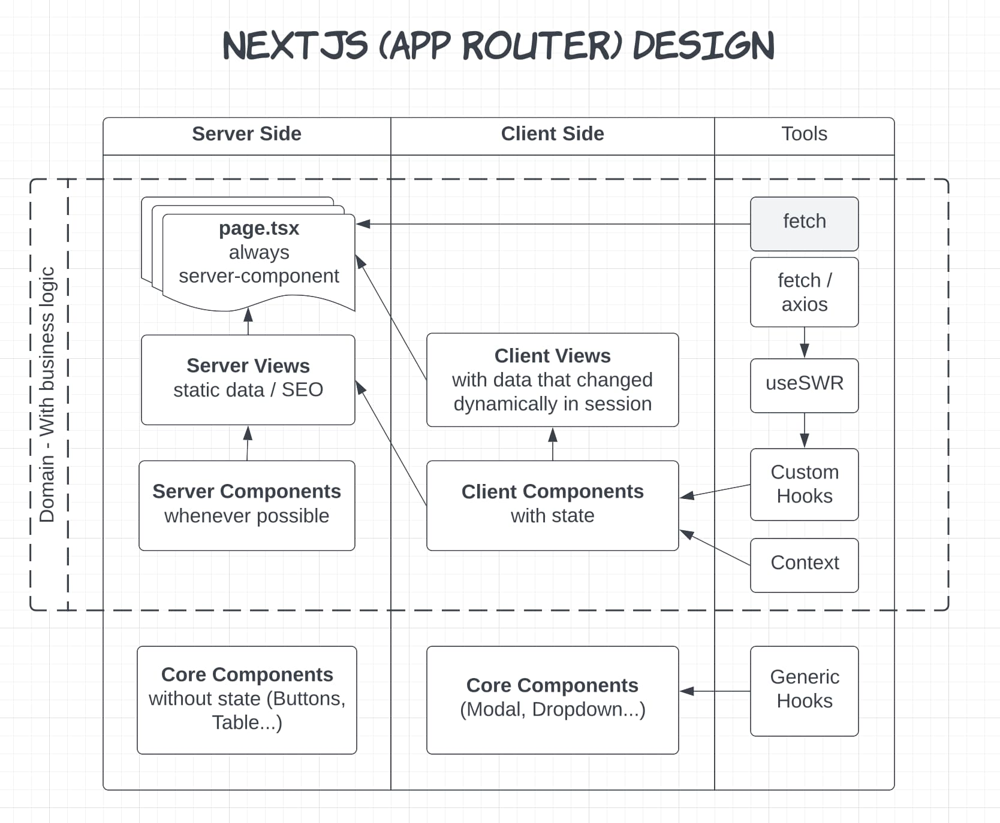

# Frontend Nextjs

## Components Design



## Filter out console warning

`InitApp.tsx`
```tsx
'use client'

export const InitApp = () => {
  useEffect(() => {
    /// other init
  }, []);
  return <>
  </>;
};

// Ignore 
const _error = console.error;
console.error = (...e) => {
  if (!(e.toString().startsWith('Warning: '))){
    _error(...e)
  }
}
```

`layout.tsx`
```tsx
export default function Layout({
                                     children,
                                   }: {
  children: React.ReactNode
}) {
  return (
    <div>
      <InitApp/>
      {children}
    </div>
  )
}

```

## Git action to deploy to a server

```yaml
name: Deploy to server

on:
  push:
    branches:
      - main
      - hotfix/build


jobs:
  build_and_deploy:
    runs-on: ubuntu-latest
    env:
      HOST_IP: 123.123.123.123
      HOST_SSH_ED25519: 
      HOST_SSH_SHA2: 
      WEBSITE_PATH: /website 
      PROCESS_NAME: website
    steps:
      - uses: actions/checkout@v3
      - uses: actions/setup-node@v3
        with:
          node-version: 16
          cache: 'yarn'
      - uses: webfactory/ssh-agent@v0.7.0
        with:
          ssh-private-key: ${{ secrets.SSH_PRIVATE_KEY }}

      - name: Add hosts
        run: |
          echo "$HOST_IP ssh-ed25519 $HOST_SSH_ED25519" >> ~/.ssh/known_hosts
          echo "$HOST_IP ecdsa-sha2-nistp256 HOST_SSH_SHA2" >> ~/.ssh/known_hosts

      # Test if SSH key is working
      - run: ssh root@$HOST_IP "touch $WEBSITE_PATH/ping"
      - run: yarn install
      - run: yarn build

      - name: Compress and send package to server
        run: |
          rm -rf .next/cache
          tar -zcvf dist.tar.gz .next public
          scp dist.tar.gz root@$HOST_IP:/var/www/fortune-web/dist.tar.gz

      - name: Extract and restart server
        run: ssh root@$HOST_IP "cd $WEBSITE_PATH && tar -xf dist.tar.gz && pm2 delete $PROCESS_NAME; pm2 start npm --name $PROCESS_NAME -- start"

```